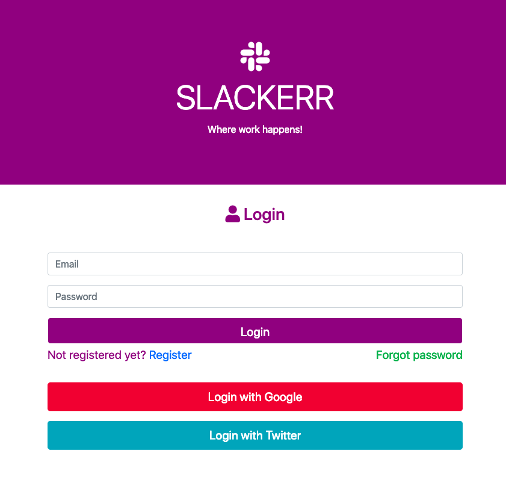
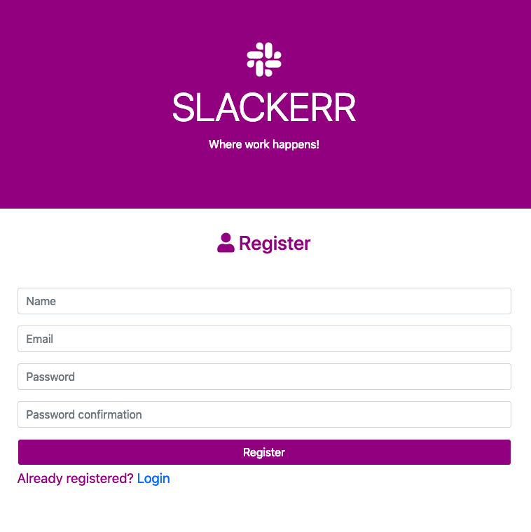
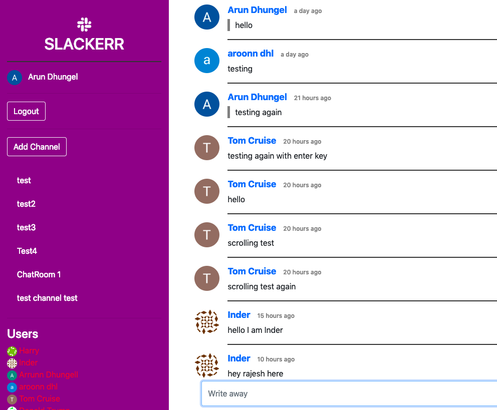

# Slackerr

This is a simple clone to slack where a user can also login/signup through google and twitter auth. A user can create new channel, send message in different channel and see who is online or offline. The message is shown instantly using firebase real-time database.

## Tech Stack Used

This web-app is built on vue, vuex as front end and firebase as backend.
Other packages used are: bootstrap for styling, moment for timestamp, md5 hash generator to create new hashes for every new user to get unique avatars, and font-awesome for some cool icons.  

# Demo
You can visit this web-app in https://vueslackerr.firebaseapp.com

# Screenshots:

Here are some screenshots to show how the app look like.

# Suggestions

Please feel free to leave any feedbacks or you are most welcome to fork it and try out yourself.
